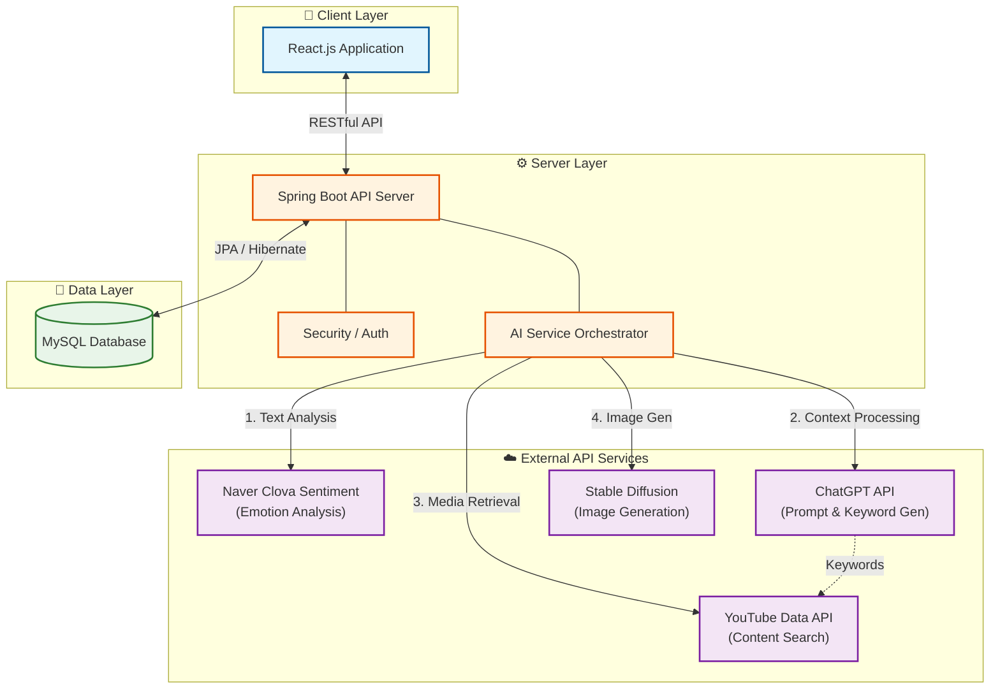

# 📘 BlueMemories

> **당신의 감정을 기록하고, AI와 함께 새로운 이야기를 만들어가는 플랫폼**

## 📖 목차 (Table of Contents)

1. [프로젝트 소개](#-프로젝트-소개-introduction)

2. [주요 기능](#-주요-기능-key-features)

3. [기술 스택](#-기술-스택-tech-stack)

4. [시스템 아키텍처](#-시스템-아키텍처-system-architecture)

5. [화면 예시](#-화면-예시-screenshots)

## 📝 프로젝트 소개 (Introduction)

**BlueMemories**는 사용자의 일상을 기록하는 것을 넘어, AI 기술을 활용해 감정을 시각화하고 창작 활동으로 연결해주는 웹 플랫폼입니다.

단순히 텍스트로 남겨지는 일기가 아니라, NLP(자연어 처리) 모델이 그날의 감정을 분석하여 수치화하고, 사용자의 기분에 딱 맞는 **콘텐츠를 추천**합니다. 더 나아가, 사용자는 자신의 이야기를 바탕으로 **AI와 협업**하여 **그림책**이나 **소설**을 창작하고 다른 사람들과 감정을 공유할 수 있습니다.

## ✨ 주요 기능 (Key Features)

| 기능 (Feature) | 설명 (Description) |
| :--- | :--- |
| **📊 AI 감정 분석** | 작성된 일기를 분석하여 **긍정/중립/부정** 수치로 시각화하여 사용자에게 제공합니다. |
| **🎬 힐링 콘텐츠** | 분석된 오늘의 기분에 맞춰 **유튜브(YouTube)** 영상(음악, 영상)을 자동으로 사용자에게 추천합니다. |
| **🤝 교환 일기** | 친구, 연인 또는 익명 사용자와 일기를 교환하며 **감정 기반의 소통**을 할 수 있습니다. |
| **🧸 그림책 창작** | 내 이야기의 문맥을 AI 그림 생성으로, 어울리는 삽화(일러스트)를 생성해 이야기의 생동감을 더해줍니다. |
| **📖 소설책 집필** | 내가 직접 소설을 쓰고, 이야기 분위기에 맞는 이미지를 텍스트로 작성하여 AI 이미지 생성을 통해 **표지 이미지**를 생성하여 전자책을 만듭니다. |

## 🛠 기술 스택 (Tech Stack)

### 🎨 Frontend

- **Core:** `React`, `JavaScript`

- **Styling:** `CSS3`, `Styled-Components`, `figma`

### ⚙️ Backend

- **Language & Framework:** `Java`, `Spring Boot`

- **Database:** `MySQL`

- **API:** RESTful Architecture

### ☁️ Infrastructure

- **Container:** `Docker`, `Docker Compose`

- **Environment:** Local Development

### 🤖 AI & Analytics

| 구분 | 사용 기술 | 용도 |
| :--- | :--- | :--- |
| **LLM** | **OpenAI API (GPT-3.5)** | 텍스트 분석, 동영상 추천 검색어 생성 |
| **Sentiment Analysis** | **Clova Sentiment** | 문장 감정 분석 |
| **Image Gen** | **Stable Diffusion** | 그림책 삽화 및 표지 생성 |
| **Data** | **YouTube Data API v3** | 맞춤형 동영상 추천 |

## 🏗️ 시스템 아키텍처 (System Architecture)

**BlueMemories**는 React 프론트엔드와 Spring Boot 백엔드를 중심으로 구성되어 있으며, 다양한 외부 API를 사용합니다.

### 🔄 데이터 처리 및 서비스 흐름도

## 📱 화면 예시 (Screenshots)

### 1️⃣ 감정 분석 및 추천

| 메인 대시보드 | 콘텐츠 추천 화면 |
| :---: | :---: |
|  |  |

### 2️⃣ AI 창작 스튜디오

| AI 그림책 생성 | 소설 표지 생성 |
| :---: | :---: |
|  |  |

## 📂 발표 자료

이 프로젝트에 대한 더 자세한 내용은 아래 발표 자료를 통해 확인하실 수 있습니다.

- [📄 **발표 자료(PDF) 다운로드**]
(https://github.com/yss9/blueMemories-origin-/blob/main/BlueMemories.pdf)
